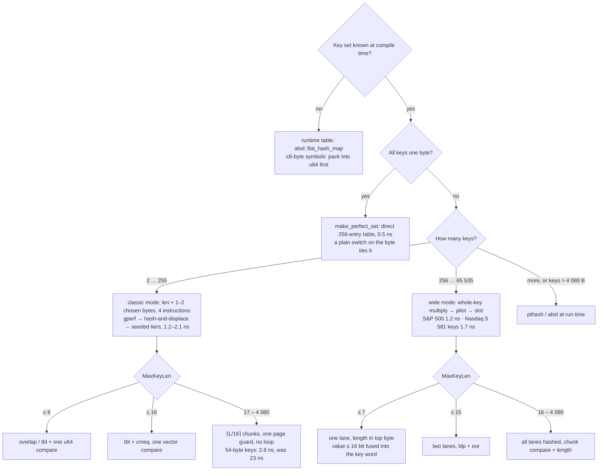

# Experimental diary — `francisco/experimental`

*Started 2026-08-29. Branch base: `francisco/hard-cases` (`a986ee7`), which itself sits on
`main` (`076a1b8`). Everything measured on an Apple M3 Max (128 KB L1D / 16 MB L2 per
performance cluster), AppleClang 15 (`-std=c++2b -O3 -arch arm64`), perf counters via
`sudo`. Numbers are fastest-of-N over 200 K shuffled lookups unless stated.*

## Goal

Make the library lead on **every** realistic key-set shape, not only `N ≤ 255` with keys
≤ 32 bytes, while keeping the philosophy: the search runs in the compiler, the runtime
reads flat arrays, verification is SIMD and branchless. Concretely:

1. `N > 255` — the byte-indexed design (`uint8_t` asso values, slots, indices) caps the
   library at 255 keys. Target data sets: the S&P 500 (503 symbols) and every Nasdaq-listed
   symbol (5 581).
2. Keys longer than 32 bytes — today the comparison falls off the SIMD ladder into a
   scalar byte loop.
3. Measure against the existing field **and** the structures people actually use in
   order-book / feed-handler code (sorted array + binary search, array trie, symbol packed
   into an integer key → integer hash map).
4. Keep this diary, and end with a decision tree for "when to use which mode".

## Day 1 — 2026-08-29

### Datasets

`benchmarks/data/gen_symbol_headers.py` turns the raw exchange files into headers:

| set | keys | lengths | charset | misses |
|---|---|---|---|---|
| S&P 500 (`sp500_symbols`) | 503 | 1:10 · 2:46 · 3:281 · 4:163 · 5:3 | `A-Z .` (BRK.B, BF.B) | 503 Nasdaq-listed symbols not in the index |
| Nasdaq-listed (`nasdaq_symbols`) | 5 581 | 1:1 · 2:71 · 3:596 · 4:3991 · 5:922 | `A-Z` | 5 581 NYSE/other-listed symbols not on Nasdaq |

Sources: `nasdaqtrader.com` symbol directory (`nasdaqlisted.txt`, `otherlisted.txt`, test
issues excluded) and the `datasets/s-and-p-500-companies` constituents CSV. Misses are
*real* tickers from the other venue, so a miss stream looks exactly like a hit stream.

GNU gperf 3.0.3 handles both (`sp500.gperf` → `MAX_HASH_VALUE 1770`, 4 s for Nasdaq →
`MAX_HASH_VALUE 70264`, i.e. a 70 K-pointer `wordlist[]` for 5 581 keys — 562 KB of
pointers, which will matter).

### Decision 1 — a separate "wide" container, not a widened byte container

Widening every `uint8_t` in `perfect_hash_set` to `uint16_t` would double the hot tables
for every existing user and still leave the gperf-form hash, whose asso values must
separate all N keys with ≤ 16 positions × 256 characters of freedom: for 5 581 keys of
≤ 5 uppercase letters that is ~130 unknowns for 5 581 constraints — a structural dead end
(the failure atlas measured the wall at 129 keys for realistic sets). The `N > 255` regime
needs a whole-key hash. So: new headers, same API surface.

* `detail/simd16.h` — a 16-byte "chunk" abstraction (page-safe masked load, lane
  extraction, chunk equality) shared by the wide container and the long-key compare.
* `detail/wide_generator.h` — the consteval search.
* `wide_perfect_hash.h` — `wide_perfect_hash_set/map`, `make_wide_perfect_*` factories
  (keys as a `const auto&` NTTP so the chosen table size can be part of the type).

### Decision 2 — the hash shape: compile-time PTHash with the cheapest possible runtime

```
lanes  = key as little-endian u64 words (length folded into a spare top byte)
h      = (lane0 ^ seed) * K0  [^ (lane_i ^ seed_i) * K_i ...]     one multiply per lane
bucket = h >> (64 - log2 B)                                        B = next_pow2(N)/2
base   = (h >> (64 - log2 B - log2 M)) & (M - 1)                   M = next_pow2(N) (×2 if needed)
slot   = (base + pilot[bucket]) & (M - 1)                          u16 pilot
hit    = packed lanes at slot == lanes                              ldp + eor + eor + orr
```

This is PTHash/CHD with additive displacement. Two things are deliberately *not* like the
research code:

* **No avalanche by default.** The bucket and base bits are the top bits of a single
  multiplicative hash. That would be reckless for a runtime table; here the generator
  verifies the whole placement at compile time and simply re-rolls the seed when the fast
  hash produces a dead pair (same bucket, same base). A `Strong` variant with a final mix
  exists as the fallback and is selected per instance — the runtime pays for it only when
  the fast one could not build.
* **Power-of-two everything**, so the runtime is shifts and masks, and the pilot is an
  *additive* displacement (an XOR with a 64-bit pilot hash would be exactly as good under
  a mask, and we would store 8 bytes per bucket instead of 2).

Why dead pairs are rare enough: expected same-bucket pairs ≈ N²/2B, each dead with
probability 1/M. Nasdaq: 5581²/(2·4096) ≈ 3 800 pairs × 1/8192 ≈ 0.46 → ~63 % of seeds are
clean. S&P 500 at M = 512 (98 % load!): ≈ 494 pairs / 512 ≈ 0.96 → ~38 % clean.

### First results (chrono harness, hits, best of 20 × 200 K)

| set | build | table | hash | compile | lookup |
|---|---|---|---|---|---|
| S&P 500 (503) | 256 buckets, tight table | 512 (98 % load) | fast (1 multiply) | 4.0 s | **1.64 ns** |
| Nasdaq (5 581) | 4 096 buckets, tight table | 8 192 (68 % load) | fast (1 multiply) | 303 s → **4.6 s** | **1.83 ns** |

Both verified at compile time (the constructor re-runs every lookup) and at run time
against the miss lists (no false positives).

**Issue 1 — the 303 s compile.** Not the search: the generator's duplicate-key check was the
same O(N²) `string_view` sweep the ≤255 factories use. At N = 5 581 that is 15.6 M
`string_view` comparisons inside the constant evaluator (~1000× slower than native) — five
minutes. Replaced by an O(N log N) heap sort on the packed lanes (identical lanes ⇔
identical key, or two keys that differ only by trailing NULs, which no lane hash could
separate anyway). Compile time 303 s → 4.6 s for the same plan. Lesson recorded for the
≤255 path too: **anything O(N²) in consteval is a wall**, even when it looks free.

**Issue 2 — `constexpr-phf` upstream moved.** Reconfiguring re-fetched `Kronuz/constexpr-phf`
at `master`, which was rewritten in 2026-08 ("slim repo to the integer engine") and no
longer ships `hashes.hh`/`fnv1ah32`. Pinned `GIT_TAG 0776e93` in `benchmarks/CMakeLists.txt`
(the commit the benches were written against). Anyone reconfiguring `main` today hits the
same break.

### Long keys (> 32 bytes) — first data point

New key set **Java FQCNs**: 40 fully-qualified class names, 24–54 bytes (median 39), 20
misses that are real class names or near-misses (`…ConcurrentHashMa`, `…RequestMappings`).
`MaxKeyLen = 54` → four 16-byte chunks. The generator picked `h = len + asso[key[26]] & 63`
— one position; long keys are *easy* to hash, they were only expensive to *verify*.

With the new fixed-count chunk compare (`compare_chunks<54>`: 4 masked loads, 4 `cmeq`,
3 `and`, 1 reduce; no branch on the length):

| method | hits ns | cycles | instr | IPC | bm |
|---|---|---|---|---|---|
| **ours (SIMD chunks)** | **3.46** | 13.1 | 101.7 | 7.77 | 0.08 |
| absl::flat_hash_map | 7.64 | 30.7 | 153.9 | 5.01 | 0.40 |
| gperf | 12.35 | 49.3 | 150.2 | 3.05 | 1.25 |
| ankerl::dense | 15.45 | 59.4 | 160.0 | 2.69 | 1.07 |
| std::unordered_map | 17.78 | 67.3 | 162.8 | 2.42 | 0.91 |
| kronuz::phf | 24.16 | 95.5 | 223.0 | 2.34 | 0.97 |
| pthash | 29.71 | 113.3 | 552.0 | 4.87 | 1.49 |
| sorted array + binary search | 33.02 | 129.6 | 297.0 | 2.29 | 2.05 |
| frozen::unordered_map | 53.13 | 214.0 | 592.0 | 2.77 | 1.26 |

The "before" (a second build dir, `build-scalar`, with
`-DCONSTEXPRCORE_USE_SIMD_CHUNKS_FOR_LONG_KEYS=0` — exactly the path `main` ships):

| | hits ns | cycles | instr | IPC | bm |
|---|---|---|---|---|---|
| scalar byte loop (main) | 23.03 | 87.8 | 585.8 | 6.67 | 0.08 |
| SIMD chunks, 4 guards | 3.46 | 13.1 | 101.7 | 7.77 | 0.08 |

**6.7× on the first cut**, from removing 480 instructions per lookup. Note the scalar loop
had no branch misses either (it is the `safe_byte_` conditional-arithmetic loop) — this is
purely an instruction-count win, the opposite of the Act III story where the byte loop
lost on mispredicts. 101 instructions is still fat for what it does: four separate
page-safety guards and four mask-table address computations.

**Decision 3 — one page guard per key, not per chunk.** `compare_chunks<MaxKeyLen>` now
tests `(addr & 4095) <= 4096 - 16·C` once (98.4 % taken for C = 4, key-independent) and
then issues unguarded loads; the rare page-straddling key is copied into a zeroed
64-byte stack buffer and compared through the same code. `MaxKeyLen ≤ 4080` keeps the
guard single-page. (numbers below)

### Portability check

The SSE2 side of `simd16.h` (`and_masks` instead of `tbl`, `pmovmskb` reduce,
`unpackhi` for lane 1) was compiled and run on x86-64 under Docker (`gcc:16`,
linux/amd64, emulated): the S&P 500 wide map builds and verifies, and the full doctest
suite — including the new wide/long-key tests — passes 1 723/1 723 assertions. The LSX
side is written to mirror `lsx_compare.h` but is untested here (no LoongArch machine).

### Ticker benchmark, round 1 (perf counters, hits, 200 K shuffled, fastest of 300)

`bench_tickers` — our wide map vs the whole field plus the order-book baselines. The
`u64 symbol → …` rows pack the ticker into a u64 **with our own page-safe `tbl` load**
before probing an integer map, i.e. the strongest version of the "symbol as integer id"
idiom feed handlers use.

| S&P 500 (N=503) | ns | cycles | instr | IPC | bm |
|---|---|---|---|---|---|
| **ours (wide-pilot)** | **1.94** | 7.3 | 54.3 | 7.39 | 0.01 |
| u64 symbol → absl::flat_hash_map | 2.24 | 9.0 | 55.4 | 6.18 | 0.02 |
| kronuz::phf | 4.12 | 16.7 | 43.1 | 2.58 | 0.48 |
| array trie (27-ary) | 5.13 | 19.4 | 54.7 | 2.82 | 0.47 |
| u64 symbol → std::unordered_map | 5.63 | 22.9 | 42.5 | 1.86 | 0.31 |
| gperf | 5.68 | 23.1 | 80.6 | 3.49 | 0.61 |
| u64 symbol → ankerl::dense | 6.86 | 27.4 | 49.9 | 1.82 | 0.49 |
| absl::flat_hash_map | 7.54 | 30.6 | 106.3 | 3.47 | 0.48 |
| pthash | 8.63 | 32.7 | 133.1 | 4.08 | 0.47 |
| frozen::unordered_map | 9.43 | 38.3 | 78.6 | 2.05 | 0.93 |
| ankerl::dense | 11.62 | 43.9 | 103.9 | 2.37 | 0.92 |
| std::unordered_map | 12.15 | 49.1 | 112.1 | 2.28 | 0.80 |
| sorted array + binary search | 52.99 | 213.4 | 386.8 | 1.81 | 3.79 |

| Nasdaq (N=5 581) | ns | cycles | instr | IPC | bm |
|---|---|---|---|---|---|
| **ours (wide-pilot)** | **2.70** | 10.2 | 58.2 | 5.70 | 0.01 |
| u64 symbol → absl::flat_hash_map | 2.93 | 11.9 | 55.7 | 4.68 | 0.05 |
| kronuz::phf | 4.56 | 18.5 | 50.2 | 2.71 | 0.30 |
| array trie (27-ary) | 5.53 | 22.5 | 65.5 | 2.91 | 0.29 |
| gperf | 6.36 | 24.1 | 96.6 | 4.02 | 0.51 |
| absl::flat_hash_map | 6.41 | 25.8 | 100.3 | 3.89 | 0.36 |
| pthash | 7.28 | 27.5 | 130.0 | 4.72 | 0.29 |
| u64 symbol → std::unordered_map | 10.12 | 38.3 | 48.2 | 1.26 | 0.48 |
| frozen::unordered_map | 11.26 | 45.1 | 87.8 | 1.95 | 0.80 |
| u64 symbol → ankerl::dense | 13.59 | 52.5 | 60.4 | 1.15 | 1.02 |
| std::unordered_map | 15.56 | 63.0 | 103.6 | 1.64 | 0.77 |
| ankerl::dense | 15.67 | 62.6 | 99.9 | 1.60 | 1.32 |
| sorted array + binary search | 71.60 | 288.5 | 490.8 | 1.70 | 5.90 |

First place on both, with 0.01 branch misses per lookup — but only 10–15 % ahead of the
best baseline, and 54–58 instructions per lookup is well above what the design needs.
Note the trie: 55 instructions, same as ours, at 2.6× the time — it is a chain of five
dependent loads with a branch per character (0.47 bm). And the Nasdaq column shows the
working-set effect: same instruction count as S&P 500, +3 cycles — the 104 KB hot set
(64 KB packed keys + 32 KB `int` values + 8 KB pilots) is pushing the 128 KB L1D.

### Instruction-level pass on the wide lookup

Disassembly of a `noinline` `lookup(string_view)` for the S&P 500 map, hit path, 44
instructions. Where they went, and the fixes:

| cost | cause | fix |
|---|---|---|
| 8 instr | two 64-bit immediates (`mov` + 3×`movk` each): the seed xor-ed into the lane, then the multiplier | drop the xor-seed; re-roll the **multiplier** instead (`K = splitmix(seed·8+lane) \| 1`) — one immediate, same dead-pair escape |
| 3 instr | `tbl` mask table reached through the GOT (`adrp` + `ldr` + `ldr`) — an `inline constexpr` array is a weak external on Mach-O | internal-linkage (`static`) copy in `simd16.h` → `adrp` + `add` + `ldr` |
| 3 instr | `add` before each indexed load because `pilots_`, `packed_lanes_`, `slot_values_` sit at non-zero struct offsets | `pilots_` first in the set, `slot_values_` first in the map (the packed-lane load keeps its `add`; the others fold into the loop-invariant base) |
| 2 instr + a branch | `len <= MaxKeyLen` compiled to `cmp; b.hi` | fold it into the length byte: clamp to `MaxKeyLen + 1` (≤ 16, still one chunk) — a too-long key carries a length byte no stored key has; one `cmp; csel` serves the load and the byte |
| 16 KB of L1 | `int` values in the index map | `make_wide_perfect_index_map` picks `uint8_t`/`uint16_t`/`uint32_t` by N |

`Strong` also became a template parameter (it was a folded member; now it is structurally
zero-cost). Result: **34 instructions** on the hit path, four of them loop-invariant
(`adrp/add` pairs and a `mov #6`). Hot path is now literally the comment at the top of
`wide_perfect_hash.h`:
`ldr q0 · tbl · fmov · orr len<<56 · mul · lsr · and · ldrh pilot · lsr · add · and · ldr packed · cmp · ldrh value`.

### Ticker benchmark, round 2 (after the instruction-level pass)

| | S&P 500 hits | Nasdaq hits |
|---|---|---|
| ours, round 1 | 1.94 ns · 54 instr · 7.3 c | 2.70 ns · 58 instr · 10.2 c |
| **ours, round 2** | **1.28 ns · 36 instr · 4.9 c** | **1.67 ns · 40 instr · 6.8 c** |
| u64 symbol → absl::flat_hash_map | 2.21 ns | 3.02 ns |
| kronuz::phf | 4.46 ns | 4.80 ns |
| array trie | 4.81 ns | 5.54 ns |

−18 instructions bought −34 % / −38 %. The lead over the best baseline went from ~1.1×
to **1.7–1.8×**, and the S&P 500 lookup is now in the same band as the ≤255-key sets in
the talk (URL protocols 1.19, Headers 1.27).

### Decision 4 — fuse the value into the key word

For keys ≤ 5 bytes, the stored 64-bit lane is `[k0..k4][free][free][len]`: two spare bytes.
`wide_perfect_hash_map` now stores integral values of ≤ 16 bits *inside* those bytes
(`FusedBits`, chosen automatically from `sizeof(ValueT)` and the spare room, e.g. 16 bits
for ≤ 5-byte keys, 8 bits for ≤ 6-byte keys, 24 bits for ≤ 4-byte keys; also for 9–15-byte
keys in lane 1). The compare masks them with one logical-immediate `and`
(`tst x, #0xff0000ffffffffff`), and the value comes out of the load the compare already
did (`ubfx`), so the separate value table — and its load — disappear. The map re-verifies
every key after fusing.

| | S&P 500 | Nasdaq |
|---|---|---|
| object size, index map | 8 704 → **7 680 B** | 134 064 → **117 680 B** (hot: 64 KB keys + 8 KB pilots) |
| hits | 1.28 → **1.20 ns** (36 instr) | 1.67 → **1.68 ns** (40 instr) |

Same instruction count (`ubfx` replaced `ldrh`), one load fewer, 16 KB less L1 pressure on
Nasdaq. The Nasdaq number did not move: its extra ~2 cycles over S&P 500 are the input
stream and the 64 KB key table, not the value table. Kept — it is free and it shrinks the
object.

### All workloads (round 3, fused)

| S&P 500 (N=503) | hits | misses | mixed 50/50 |
|---|---|---|---|
| **ours** | **1.20** (0.01 bm) | **1.16** (0.00) | **7.67** (0.51) |
| u64 → absl | 2.38 | 2.83 | 10.05 |
| kronuz::phf | 4.15 | 3.53 | 7.92 |
| array trie | 4.78 | 5.75 | 8.33 |
| absl::flat_hash_map | 7.58 | 3.00 | 9.31 |

| Nasdaq (N=5 581) | hits | misses | mixed 50/50 |
|---|---|---|---|
| **ours** | **1.68** (0.00 bm) | **1.43** (0.01) | **8.99** (0.51) |
| u64 → absl | 3.01 | 5.30 | 11.43 |
| kronuz::phf | 4.31 | 4.73 | 11.53 |
| array trie | 5.88 | 7.63 | 10.22 |
| absl::flat_hash_map | 6.61 | 7.54 | 12.65 |

Misses are *faster* than hits for us (the compare rejects, nothing else is fetched) and
remain branch-free. Mixed is the caller's `if (opt)` coin flip for everybody: our 0.51 bm
is exactly that branch, the lookup itself contributes none — the same story as the ≤255
sets in the talk.

### Long keys, all workloads (Java FQCNs, N=40, MaxKeyLen=54)

| | hits | misses | mixed |
|---|---|---|---|
| main (scalar loop) | 23.03 | — | — |
| **ours (SIMD chunks, 1 guard)** | **2.83** (78 instr, 0.08 bm) | **3.38** (0.32 bm) | **6.83** |
| absl::flat_hash_map | 7.69 | 7.94 | 12.27 |
| gperf | 12.74 | 7.91 | 12.09 |

The single guard took the hit path from 101 → 78 instructions and 3.46 → 2.83 ns
(**8.1× over main**). The residual 0.08 bm on hits is the page guard itself firing on keys
that straddle a 4 KiB boundary in the input buffer (the FQCN pool is 1.6 KB of strings,
so a few keys sit near an edge); 0.32 on misses is the compare's outcome branch on a
stream that mixes 20 different miss shapes.

### API: no new spelling needed

`make_perfect_map<kv<...>...>()` / `make_perfect_set<...>()` now dispatch to the wide
container past 255 entries (via a static-storage key array built from the pack), so the
S&P 500 can be written exactly like the S&P 100 in the benches. For big generated sets
`make_wide_perfect_index_map<array>()` / `make_wide_perfect_map<keys, values>()` take an
`inline constexpr std::array<std::string_view, N>` by reference.

### Round 4 — the 17–32-byte classic path through the same chunk compare

`neon_compare_32` guarded each of its two loads separately. Routing `MaxKeyLen` 17–32
through `compare_chunks<MaxKeyLen>` (one guard) is −2 instructions at identical time
(HTTP Headers 50: 1.90 → 1.90 ns, 62 → 60 instructions), and — more importantly — it
makes the 17–32-byte path SIMD on x86-64/LSX too, where the old `*_compare_32` helpers
were never enabled. Kept, behind `CONSTEXPRCORE_USE_SIMD_CHUNKS_FOR_32` (default 1). The
other classic sets are untouched (Protocols 1.27, Keywords 1.42, Headers 1.33, MIME 1.51,
JS 1.57, S&P 100 1.90). All 4 730 test assertions pass on arm64 and, under Docker, on
x86-64 (gcc 16).

### Ideas weighed and *not* pursued (ROI notes)

| idea | expected gain | why it lost |
|---|---|---|
| **Cuckoo-2 instead of pilots** (two candidate slots, no pilot table, 2 parallel key loads) | −4–5 cycles of *latency* | the lookup is throughput-bound on instruction count (IPC 7.4 at 36 instr ≈ 4.9 cycles), not latency-bound; cuckoo adds a load + compare + select and needs M ≥ 2N — for Nasdaq that is 128 KB of keys, out of L1 |
| **Non-power-of-two M via fastrange** (`(x·M) >> 32`) to cut Nasdaq's table from 8 192 to ~6 200 slots | −16 KB hot set | +1 multiply on the critical path, pilots become u32 (+8 KB), and the S&P 500 already sits at 98 % load on a power of two — nothing to gain there |
| **5-bit charset packing** (A–Z into 5 bits → 5-char ticker in 25 bits, u32 keys) | −32 KB on Nasdaq | data-set-specific, and verification would have to compare the *original* bytes anyway to reject `aapl` — no instruction saved |
| **Scalar 8-byte load + shift mask instead of `ldr q`/`tbl`/`fmov`** for ≤ 7-byte keys | avoids the ~4-cycle vector→GPR move | needs two `csel`s to be shift-safe at len 0/8 → 6–7 instructions vs 4; throughput-bound, so a wash; kept the vector path shared with the compare ladder |
| **Second multiply / avalanche by default** | more uniform bucket bits | the fast single-multiply form built every set on its first few seeds (S&P 500 seed index 4, Nasdaq seed 1); `Strong` stays as the automatic fallback |
| **Fusing values in the classic (≤ 255) map** (spare bytes in `packed_keys_` for ≤ 4-byte keys) | −1 load, smaller object | the classic path is already the leader on those sets and the talk's numbers are frozen; noted as a follow-up, not done on this branch |
| **`-fconstexpr-steps` beyond 2³¹** | none needed | Nasdaq builds in 4.6 s well inside `4294967295`; the flag only mattered once the O(N²) duplicate check was gone |

### Issues log

1. **O(N²) consteval duplicate check** — 303 s compile at N = 5 581. Replaced by a heap
   sort on the lanes (4.6 s). The classic factories still carry the O(N²) check; harmless
   at N ≤ 255 (32 K comparisons).
2. **`Kronuz/constexpr-phf` master rewritten upstream** — `hashes.hh` gone; pinned to
   `0776e93`. `main` will hit this on its next clean configure.
3. **`std::pair<frozen::string,int>` is not default-constructible** — `frozen` maps must be
   built through an index-sequence pack, not a filled-in array.
4. **gperf outputs define the same macros** (`TOTAL_KEYWORDS`, `MAX_HASH_VALUE`, …) — two
   generated files in one TU need `#undef`s between them.
5. **`MaxKeyLen == 16` in wide mode** has two lanes but no spare byte for the length; it now
   takes the chunk + explicit-length path (was: lane compare without a length check → a
   NUL-padded query could false-positive).
6. **`kv<>::value` is `const T`** — the wide factory must take the array's `value_type`
   as-is rather than `remove_cvref` it, or the constructor does not match.
7. **A NUL inside a `const char*` literal truncates a `string_view`** — two of my own test
   assertions, not the library.
8. **Xcode 15's `c++` needs `-isysroot`** when driven outside CMake, and spells C++23
   `-std=c++2b`.

### Decision tree

`docs/decision_tree.svg` (rendered below as text). The same tree, condensed:



## Final leaderboard (hits, ns/lookup, fastest of 300 × 200 K shuffled, M3 Max)

`bench_protocol` (9 original sets + Java FQCNs) and `bench_tickers` (S&P 500, Nasdaq), every
method in the suite. "nearest" is the best competitor on that set.

| key set | N | MaxKeyLen | **ours** | nearest competitor | vs nearest | std::unordered_map | vs umap |
|---|---|---|---|---|---|---|---|
| URL Protocols | 6 | 5 | **1.27** | kronuz 5.11 | 4.0× | 12.23 | 9.6× |
| C++ Keywords | 15 | 6 | **1.42** | kronuz 5.43 | 3.8× | 11.61 | 8.2× |
| HTTP Headers | 20 | 15 | **1.28** | kronuz 8.10 | 6.3× | 15.89 | 12.4× |
| MIME Types | 15 | 16 | **1.51** | absl 7.93 | 5.2× | 11.29 | 7.5× |
| JS Reserved | 45 | 10 | **1.57** | kronuz 6.92 | 4.4× | 16.22 | 10.3× |
| HTTP Headers 50 | 50 | 19 | **1.90** | gperf 8.44 | 4.4× | 15.60 | 8.2× |
| S&P 100 Tickers | 100 | 5 | **1.77** | kronuz 4.50 | 2.5× | 12.26 | 6.9× |
| Counters | 10 | 21 | **3.18** | kronuz 8.88 | 2.8× | 14.48 | 4.6× |
| Letters a–z | 26 | 1 | 0.57 | **naive switch 0.45** | 0.8× | 8.23 | 14.4× |
| **Java FQCNs** (new) | 40 | 54 | **2.89** | absl 8.31 | 2.9× | 17.87 | 6.2× |
| **S&P 500** (new, wide) | 503 | 5 | **1.27** | u64→absl 2.40 | 1.9× | 12.38 | 9.8× |
| **Nasdaq-listed** (new, wide) | 5 581 | 5 | **1.70** | u64→absl 2.98 | 1.8× | 15.99 | 9.4× |

First on 11 of 12; the single-byte set is the one where a `switch` on the byte is the
right tool (as expected — the direct table can't beat a compare-and-branch the compiler
proves away). Branch misses per lookup: 0.00–0.01 everywhere except Counters (0.31, the
known position-8 bug on `main`, untouched here) and FQCNs (0.08, the page guard on keys
that straddle a 4 KiB boundary in the input pool).

### What changed on `main` → this branch, in one table

| regime | before (main) | after | how |
|---|---|---|---|
| N > 255 | `static_assert` | 1.27 ns @ 503, 1.70 ns @ 5 581 | wide mode: whole-key multiply + u16 pilot table, verified in consteval, fused values |
| keys > 32 B | scalar byte loop, 23.0 ns @ 54 B | 2.89 ns | ⌈L/16⌉ masked chunk compares behind one page guard |
| keys 17–32 B | per-ISA two-guard helper, NEON only | shared one-guard chunk compare, all ISAs | same `compare_chunks` |
| API | `make_perfect_map` ≤ 255 | same call dispatches to wide past 255; `make_wide_perfect_index_map<array>()` for generated lists | static-storage key arrays as reference NTTPs |
| compile time | — | 4.6 s for 5 581 keys | O(N log N) duplicate check; the search itself is cheap |

### Not done / next

* **Values fused in the classic map** (≤ 4-byte keys have 3 spare bytes in `packed_keys_`):
  −1 load on Protocols/S&P 100; the classic path is the one the talk's numbers are frozen on,
  so left for a separate branch.
* **Position-8 branch bug on Counters** (0.31 bm on `main`): not in scope here, still open.
* **Wide mode above 65 535 keys**: `index_t`/`pilot_t` widen automatically, but nothing
  above 5 581 was measured; the 128 KB L1 will dominate before the algorithm does.
* **LSX path of `simd16.h`**: written to mirror `lsx_compare.h`, compiled nowhere here.
* **Counters bench for misses/mixed on the classic sets with the new 17–32 path**: only
  hits were re-run (identical time, −2 instructions); no reason to expect a change.
